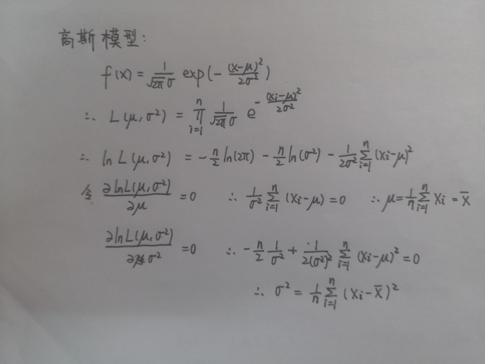

## 最大似然准则下的均值与协方差推导

## 编程思路

- 先用 `textscan()` 结合提取格式提取出 Train.txt 中的 A、B 两组数据。
- 由 A、B 两组数据计算对应的高斯模型的均值和协方差矩阵。
- 利用得到的均值和协方差矩阵构建出高斯概率模型。
- 依次比较 Test.txt 中各点在两高斯概率模型中的概率，并将该点归类为概率较大的那组。
- 由分类结果与实际对比获得准确率。

## 实验结果

- 对测试集的分类准确率为 0.7301，且在用单高斯模型对原训练集进行分类测试时结果为 0.6473。
- 由此可见单高斯模型具有一定的分类能力，但总得来说分类准确率较差，可用于简单的数据分类。
